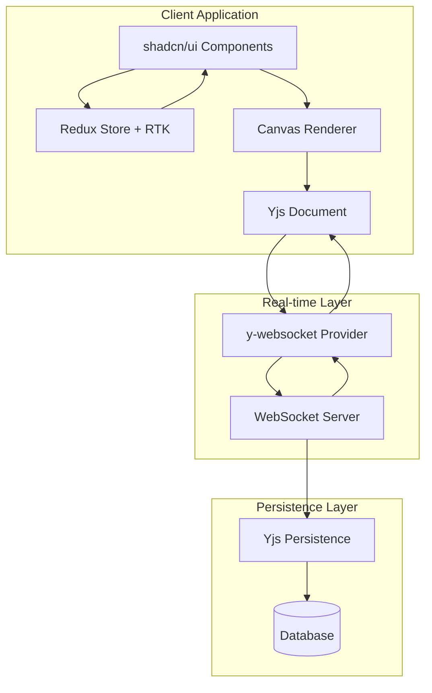
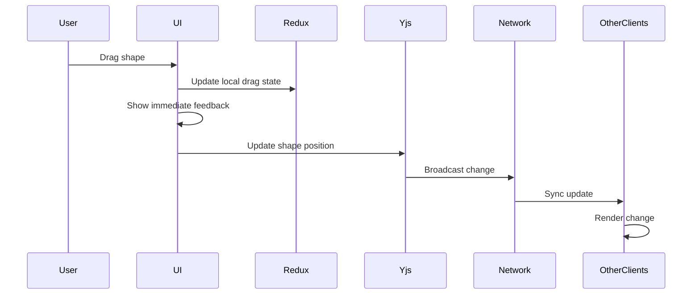

# Design Document

## Overview

The Collaborative Canvas is architected as a modern web application using Next.js 15+ with a sophisticated state management system that separates collaborative document state from local UI state. The core innovation lies in using Yjs (a mature CRDT implementation) for conflict-free real-time collaboration, while Redux Toolkit manages local application state. The UI is built with shadcn/ui components for consistency and accessibility.

The system enables multiple users to simultaneously manipulate shapes on an infinite canvas with automatic conflict resolution, real-time synchronization, and advanced interaction mechanics like multi-selection, grouping, and collaborative-aware undo/redo.

## Architecture

### High-Level Architecture



### State Architecture Separation

The application maintains a clear separation between two distinct state domains:

1. **Shared Document State (Yjs)**: Persistent, collaborative data that must be synchronized
   - Shape positions, dimensions, colors, text content
   - Shape hierarchy and grouping relationships
   - Document-level metadata

2. **Local UI State (Redux/RTK)**: Ephemeral, client-specific data that should not be synchronized
   - Current tool selection
   - Local object selections
   - UI panel states (color picker, property panels)
   - Viewport position and zoom level
   - Drag preview states

### Data Flow Pattern



## Components and Interfaces

### Core Components

#### 1. Canvas Component
```typescript
interface CanvasProps {
  width: number;
  height: number;
  zoom: number;
  panOffset: { x: number; y: number };
}

interface CanvasState {
  shapes: Map<string, Shape>;
  selectedShapeIds: Set<string>;
  dragState: DragState | null;
}
```

**Responsibilities:**
- Render all shapes using HTML5 Canvas or SVG
- Handle mouse/touch interactions for shape manipulation
- Manage viewport transformations (pan, zoom)
- Implement virtualization for performance with large datasets

#### 2. Shape Components
```typescript
interface Shape {
  id: string;
  type: 'rectangle' | 'circle' | 'text' | 'line';
  position: { x: number; y: number };
  dimensions: { width: number; height: number };
  style: ShapeStyle;
  content?: string; // for text shapes
  groupId?: string;
}

interface ShapeStyle {
  fill: string;
  stroke: string;
  strokeWidth: number;
  opacity: number;
}
```

#### 3. Toolbar Component
Built with shadcn/ui components:
- Tool selection (select, rectangle, circle, text, line)
- Style controls (color picker, stroke width)
- Action buttons (group, ungroup, delete)
- Undo/redo controls

#### 4. Collaboration Components
```typescript
interface UserPresence {
  userId: string;
  name: string;
  avatar?: string;
  cursor: { x: number; y: number };
  selection: string[];
  isActive: boolean;
}

interface PresenceIndicator {
  users: UserPresence[];
  currentUserId: string;
}
```

### State Management Interfaces

#### Redux Store Structure
```typescript
interface AppState {
  ui: {
    currentTool: Tool;
    selectedShapeIds: string[];
    viewport: {
      zoom: number;
      panOffset: { x: number; y: number };
    };
    panels: {
      colorPicker: { open: boolean; position: { x: number; y: number } };
      properties: { open: boolean };
    };
  };
  collaboration: {
    users: UserPresence[];
    connectionStatus: 'connected' | 'connecting' | 'disconnected';
  };
}
```

#### Yjs Document Structure
```typescript
// Yjs document schema
const yjsDoc = new Y.Doc();
const shapesMap = yjsDoc.getMap('shapes'); // Y.Map<string, Y.Map>
const metaMap = yjsDoc.getMap('meta'); // Document metadata

// Each shape is stored as a nested Y.Map
const shapeData = new Y.Map();
shapeData.set('type', 'rectangle');
shapeData.set('position', { x: 100, y: 100 });
shapeData.set('dimensions', { width: 200, height: 150 });
// ... other properties
```

## Data Models

### Shape Data Model
The shape data model is designed to be serializable and conflict-free when stored in Yjs:

```typescript
class ShapeModel {
  constructor(
    public id: string,
    public type: ShapeType,
    public position: Point,
    public dimensions: Size,
    public style: ShapeStyle,
    public content?: string,
    public groupId?: string
  ) {}

  // Convert to/from Yjs Y.Map
  toYjsMap(): Y.Map<any> {
    const map = new Y.Map();
    map.set('type', this.type);
    map.set('position', this.position);
    map.set('dimensions', this.dimensions);
    map.set('style', this.style);
    if (this.content) map.set('content', this.content);
    if (this.groupId) map.set('groupId', this.groupId);
    return map;
  }

  static fromYjsMap(id: string, map: Y.Map<any>): ShapeModel {
    return new ShapeModel(
      id,
      map.get('type'),
      map.get('position'),
      map.get('dimensions'),
      map.get('style'),
      map.get('content'),
      map.get('groupId')
    );
  }
}
```

### Group Data Model
```typescript
interface Group {
  id: string;
  shapeIds: string[];
  bounds: Rectangle;
  locked: boolean;
}
```

### Interaction Models
```typescript
interface DragState {
  isDragging: boolean;
  startPosition: Point;
  currentPosition: Point;
  targetShapeIds: string[];
  dragType: 'move' | 'resize' | 'rotate';
}

interface SelectionState {
  selectedIds: Set<string>;
  selectionBounds: Rectangle | null;
  isMultiSelect: boolean;
}
```

## Error Handling

### Network Error Handling
```typescript
class CollaborationErrorHandler {
  handleConnectionLoss() {
    // Show offline indicator
    // Queue local changes
    // Attempt reconnection with exponential backoff
  }

  handleSyncConflict(conflict: YjsConflict) {
    // Yjs handles this automatically, but we can log for debugging
    console.warn('Sync conflict resolved by Yjs:', conflict);
  }

  handleInvalidShapeData(shapeId: string, data: any) {
    // Remove invalid shape and notify user
    // Log error for debugging
  }
}
```

### User Input Validation
```typescript
class ShapeValidator {
  validatePosition(position: Point): boolean {
    return Number.isFinite(position.x) && Number.isFinite(position.y);
  }

  validateDimensions(dimensions: Size): boolean {
    return dimensions.width > 0 && dimensions.height > 0;
  }

  validateStyle(style: ShapeStyle): boolean {
    return this.isValidColor(style.fill) && 
           this.isValidColor(style.stroke) &&
           style.strokeWidth >= 0;
  }
}
```

### Performance Error Handling
```typescript
class PerformanceMonitor {
  private frameTime = 0;
  
  monitorRenderPerformance() {
    // Track frame times and warn if dropping below 60fps
    // Implement shape culling if performance degrades
    // Reduce update frequency for non-critical operations
  }
}
```

## Testing Strategy

### Unit Testing
- **Shape Models**: Test serialization/deserialization with Yjs
- **Redux Reducers**: Test state transitions for UI actions
- **Utility Functions**: Test geometric calculations, collision detection
- **Validation Logic**: Test input validation and error handling

### Integration Testing
- **Yjs Integration**: Test CRDT conflict resolution scenarios
- **Redux-Yjs Bridge**: Test synchronization between local and shared state
- **Canvas Rendering**: Test shape rendering with various data states
- **Drag and Drop**: Test interaction state management

### Collaboration Testing
```typescript
describe('Collaborative Editing', () => {
  it('should merge concurrent shape modifications', async () => {
    // Create two Yjs documents
    // Simulate concurrent edits to same shape
    // Verify both changes are preserved
  });

  it('should handle user presence updates', async () => {
    // Test cursor position broadcasting
    // Test user join/leave scenarios
  });

  it('should maintain undo/redo isolation', async () => {
    // Test that user A's undo doesn't affect user B's changes
  });
});
```

### Performance Testing
- **Canvas Rendering**: Test with 1000+ shapes
- **Memory Usage**: Monitor for memory leaks during long sessions
- **Network Efficiency**: Test bandwidth usage with frequent updates
- **Offline Sync**: Test large change sets synchronizing after reconnection

### End-to-End Testing
Using Playwright or Cypress:
- Multi-user collaboration scenarios
- Real-time synchronization verification
- Complex interaction flows (multi-select, grouping, undo/redo)
- Cross-browser compatibility

### Accessibility Testing
- Keyboard navigation for all tools and shapes
- Screen reader compatibility with shape descriptions
- Color contrast compliance for UI elements
- Focus management during modal interactions

The testing strategy ensures robust functionality across all collaboration scenarios while maintaining performance standards and accessibility compliance.